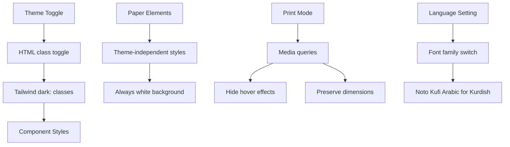

# Design Document: Dark/Light Mode Fixes

## Overview

This design addresses theme consistency, paper styling independence, print mode behavior, Kurdish font support, and UI performance improvements for the Photo Printer Pro application. The solution involves CSS modifications, Tailwind configuration updates, and component-level styling changes.

## Architecture

The implementation follows a layered approach:

1. **Global Styles Layer** (`index.html`): Tailwind configuration and base CSS rules
2. **Component Layer**: Individual component styling with proper dark mode classes
3. **Print Layer**: Media query styles for print output
4. **Font Layer**: Language-specific font application



## Components and Interfaces

### 1. Theme System

**Current Implementation:**
- Theme stored in `AppContext` state
- Toggle dispatches `TOGGLE_THEME` action
- `dark` class added/removed from `<html>` element

**Changes Required:**
- Audit all components for missing `dark:` variants
- Ensure consistent color tokens across components

### 2. Paper Styling

**Components Affected:**
- `PhotoPage.tsx`
- `PhotoSlot.tsx`
- `EditableBlock` (within PhotoPage)

**CSS Classes:**
```css
.a4-page, .a4-page-landscape {
  background-color: white !important;
  color: #111827 !important; /* gray-900 */
}
```

### 3. Print Styles

**Location:** `index.html` `<style>` block

**Key Rules:**
- `.no-print { display: none !important; }` - Hide UI elements
- Remove hover state visibility in print
- Preserve paper dimensions exactly

### 4. Font System

**Kurdish Font Application:**
- Apply `font-kufi` class when `state.language === 'ku'`
- Font family: `'Noto Kufi Arabic', sans-serif`

### 5. Performance Optimizations

**Techniques:**
- Use `memo()` for components that don't need frequent re-renders
- Add `will-change` hints for animated elements
- Use CSS `transition` properties consistently

## Data Models

No data model changes required. This feature only affects styling and presentation.

## Correctness Properties

*A property is a characteristic or behavior that should hold true across all valid executions of a system-essentially, a formal statement about what the system should do. Properties serve as the bridge between human-readable specifications and machine-verifiable correctness guarantees.*

Based on the prework analysis, most requirements relate to visual styling which is difficult to test programmatically. However, we can define one testable property:

### Property 1: Kurdish language applies Kufi font
*For any* UI component rendered when language is set to Kurdish, the computed font-family should include 'Noto Kufi Arabic'
**Validates: Requirements 4.1**

Note: Most acceptance criteria (theme consistency, print behavior, visual smoothness) are CSS-based and require visual inspection rather than property-based testing. These will be verified through manual testing and code review.

## Error Handling

- **Font Loading Failure**: Fallback to system sans-serif fonts defined in Tailwind config
- **Theme State Corruption**: Default to light theme if state is invalid
- **Print Style Conflicts**: Use `!important` declarations sparingly and only where necessary

## Testing Strategy

### Manual Testing

Due to the visual nature of these changes, primary testing will be manual:

1. **Theme Testing**: Toggle between dark/light modes and verify all components
2. **Paper Testing**: Verify paper remains white in both themes
3. **Print Testing**: Use browser print preview to verify output
4. **Font Testing**: Switch to Kurdish and verify font application
5. **Performance Testing**: Check for smooth transitions and no jank

### Unit Testing

Limited unit testing is applicable:

- Test that theme toggle updates state correctly
- Test that language change updates state correctly

### Property-Based Testing

**Library:** fast-check (for TypeScript/JavaScript)

Property tests will focus on the language-font relationship:

- **Property 1**: Verify font configuration is correct for Kurdish language setting

### Test Annotations

All property-based tests must include:
- Comment: `**Feature: dark-light-mode-fixes, Property {number}: {property_text}**`
- Minimum 100 iterations per property test
